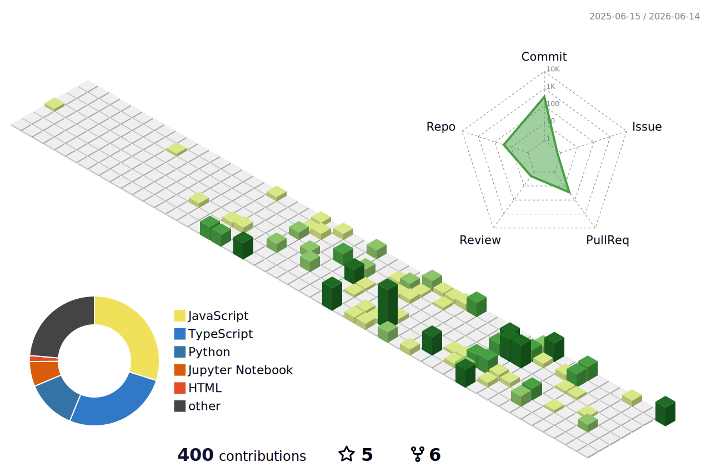

<!-- ═══════════════════════════════════════════════════════════════════════════ -->
<!-- 𝗩𝗜𝗡𝗢𝗗𝗛𝗔𝗡 𝗩 𝗔 — GitHub Profile README                                     -->
<!-- ═══════════════════════════════════════════════════════════════════════════ -->

<h1 align="center">
  
</h1>

<p align="center">
  <a href="https://www.linkedin.com/in/vinodhan21/"></a>
  <a href="mailto:vinovb21@gmail.com"></a>
  <a href="https://github.com/vinodhan07"></a>
  
  
</p>

<!-- ═══════════════════════════════════════════════════════════════════════════ -->

```python
# ⚡ vinodhan.py — who am I?
class AIEngineer:
    def __init__(self):
        self.name        = "Vinodhan V A"
        self.role        = "AI Engineer & LLM Developer"
        self.education   = "B.E. Computer Science — KIOT, Salem (CGPA: 7.7)"
        self.location    = "Salem, Tamil Nadu 🇮🇳"
        self.contact     = "vinovb21@gmail.com"

    @property
    def expertise(self):
        return [
            "🤖 AI Agents & Multi-Agent Systems",
            "🔗 RAG Pipelines (LangChain / LangGraph)",
            "👁️ Computer Vision (YOLOv8, OpenCLIP)",
            "⚙️ n8n Workflow Automation",
            "🚀 Full-Stack AI (FastAPI + React)",
        ]

    @property
    def currently_building(self):
        return {
            "OmniFlow AI": "Multi-agent workflow automation with n8n",
            "FinPilot":     "LLM-powered financial intelligence platform",
            "EnvVault":     "Secure credential management CLI",
        }

me = AIEngineer()
```

---

### 🧰 Tech Stack & Tools

<table>
  <tr>
    <td align="center" width="96"><br><sub><b>Python</b></sub></td>
    <td align="center" width="96"><br><sub><b>JavaScript</b></sub></td>
    <td align="center" width="96"><br><sub><b>React</b></sub></td>
    <td align="center" width="96"><br><sub><b>FastAPI</b></sub></td>
    <td align="center" width="96"><br><sub><b>Docker</b></sub></td>
    <td align="center" width="96"><br><sub><b>MongoDB</b></sub></td>
    <td align="center" width="96"><br><sub><b>Supabase</b></sub></td>
    <td align="center" width="96"><br><sub><b>AWS</b></sub></td>
  </tr>
  <tr>
    <td align="center" width="96"><br><sub><b>GCP</b></sub></td>
    <td align="center" width="96"><br><sub><b>PyTorch</b></sub></td>
    <td align="center" width="96"><br><sub><b>TensorFlow</b></sub></td>
    <td align="center" width="96"><br><sub><b>OpenCV</b></sub></td>
    <td align="center" width="96"><br><sub><b>Git</b></sub></td>
    <td align="center" width="96"><br><sub><b>Linux</b></sub></td>
    <td align="center" width="96"><br><sub><b>Postman</b></sub></td>
    <td align="center" width="96"><br><sub><b>VS Code</b></sub></td>
  </tr>
</table>

<p align="left">
  
  
  
  
  
  
  
  
</p>

---

### 🚀 Featured Projects

<table>
<tr>
<td width="50%" valign="top">

#### 🖼️ [AI Image Similarity Detection](https://github.com/vinodhan07/AI-Based-Image-Similarity-WEB-Scrapping-tool)
> OpenCLIP · FAISS · FastAPI · React

Built a semantic image retrieval system using **OpenCLIP embeddings** and **FAISS vector indexing**. Automated web scraping pipeline increased dataset coverage by **40%**, enabling comparison across **5,000+ images with sub-second latency**.

</td>
<td width="50%" valign="top">

#### 💰 [FinPilot — Financial Intelligence](https://github.com/vinodhan07/finai-hackops)
> Gemini · Claude · Supabase · React

Led a 4-member team to build an **LLM-powered financial analysis platform**. Engineered REST APIs for financial dataset processing. Interactive dashboards reduced manual analysis time by **40%**.

</td>
</tr>
<tr>
<td width="50%" valign="top">

#### ⚡ [OmniFlow AI — Multi-Agent Automation](https://github.com/N8n-automations-works/OmniFlow-AI)
> n8n · OpenAI · Claude · Webhooks

Developed a **multi-agent AI automation system** with **n8n workflow orchestration**. Integrated LLM-powered agents with API-driven pipelines for intelligent task execution and decision-based workflow routing.

</td>
<td width="50%" valign="top">

#### 🔐 EnvVault — Secure Credential Manager
> Python · Cryptography · CLI

Enterprise-grade CLI utility for managing **API keys and environment variables** securely. Supports encrypted credential storage and multi-project configuration deployment.

</td>
</tr>
</table>

---

### 📄 Research & Publication

<table>
<tr>
<td>📜</td>
<td>
  <strong><a href="https://ieeexplore.ieee.org/document/11167765/metrics#metrics">A Flexible Multi-Task Structure Contextual Modality Attention-Based Emotion Recognition</a></strong><br/>
  <sub>IEEE — 3rd International Conference on Sustainable Computing and Data Communication Systems (ICSCDS-2025)</sub>
</td>
</tr>
</table>

---

### 🏆 Achievements & Leadership

| 🏅 | Achievement |
|:---:|:---|
| 🥉 | **3rd Place** — Alliance One Code Sangram (National Hackathon, 36hrs, ₹30,000 prize) |
| 🎨 | **Special Prize** — AARAM'25 UX Designathon by Cybernaut EdTech |
| 🌍 | **Google Student Ambassador**, KIOT (2025–2026) |
| 🤝 | **Secretary**, Rotaract Club, KIOT (2025–2026) |

---

### 📜 Certifications

| Certificate | Issuer |
|:---|:---|
| Claude Code in Action | Anthropic |
| Master n8n AI Agents: Build & Sell AI Agents | Udemy |
| AI for Beginners | HP LIFE |
| Prompt Engineering | Great Learning Academy |

<p align="right">
  <a href="https://www.linkedin.com/in/vinodhan21/details/certifications/"><sub>🔗 View all certificates →</sub></a>
</p>

---

### 📊 GitHub Analytics

<p align="center">
  
  
</p>

<p align="center">
  
</p>

<p align="center">
  
</p>

---

### 🧊 3D Contribution Graph

<p align="center">
  
</p>

---

### 🐍 Contribution Snake

<p align="center">
  <picture>
    <source media="(prefers-color-scheme: dark)" srcset="https://raw.githubusercontent.com/vinodhan07/vinodhan07/output/github-contribution-grid-snake-dark.svg">
    <source media="(prefers-color-scheme: light)" srcset="https://raw.githubusercontent.com/vinodhan07/vinodhan07/output/github-contribution-grid-snake.svg">
    
  </picture>
</p>

---

<p align="center">
  
</p>

---

<p align="center">
  <b>💬 "Building intelligent systems that automate the complex and amplify human potential."</b>
</p>

<p align="center">
  <a href="https://www.linkedin.com/in/vinodhan21/"></a>
  <a href="mailto:vinovb21@gmail.com"></a>
</p>

<p align="center"><sub>⭐ Star my repos if you find them useful — it means a lot!</sub></p>
