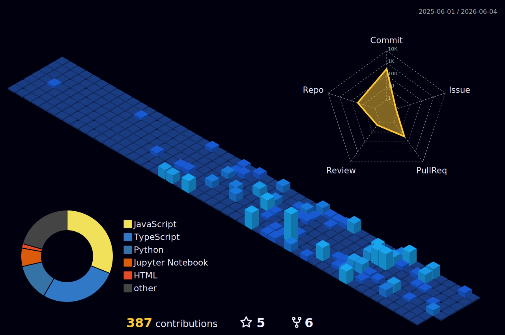

<h1 align="center">
  
</h1>

  <b>AI Engineer specializing in LLMs, Computer Vision, and Agentic Automation.</b> 
   
  

---

### 🚀 About Me

- 🔭 **Currently building**: [EnvVault](https://github.com/vinodhan07/envvault) & [FinPilot](https://github.com/vinodhan07/finpilot)
- 🌱 **Learning**: Advanced AI/ML & Scalable Backend Systems
- ⚡ **Expertise**: Generative AI, LLMs, Computer Vision, FastAPI, Docker, Supabase.
- 📫 **Email**: `vinovb21@gmail.com`
- 📄 **Research**: *A Flexible Multi-Task Structure Contextual Modality Attention-Based Emotion Recognition* (IEEE ICSCDS-2025)
- 🎓 **Google Student Ambassador** (2025-2026)
- 🏆 **3rd Place** – Alliance One Code Sangram Hackathon (National Level)

---

### 🤝 Connect with Me

  
  
  

---

### 🛠️ Tech Stack

  

---

### 📊 GitHub Stats

<table align="center" width="100%">
  <tr>
    <td align="center" width="50%">
      
    </td>
    <td align="center" width="50%">
      
    </td>
  </tr>
  <tr>
    <td colspan="2" align="center">
      
    </td>
  </tr>
</table>

---

### 📈 Activity Graph

  

---

### 🐍 Contribution Snake

  <picture>
    <source media="(prefers-color-scheme: dark)" srcset="https://raw.githubusercontent.com/vinodhan07/vinodhan07/output/github-contribution-grid-snake-dark.svg?v=1">
    <source media="(prefers-color-scheme: light)" srcset="https://raw.githubusercontent.com/vinodhan07/vinodhan07/output/github-contribution-grid-snake.svg?v=1">
    
  </picture>

---

### 🧊 3D Contribution Calendar

  

> *Note: If the 3D calendar doesn't load, you'll need to set up the [github-profile-3d-contrib](https://github.com/yoshi389111/github-profile-3d-contrib) GitHub Action.*

  <b>⭐ If you find my work helpful, consider leaving a star!</b>

